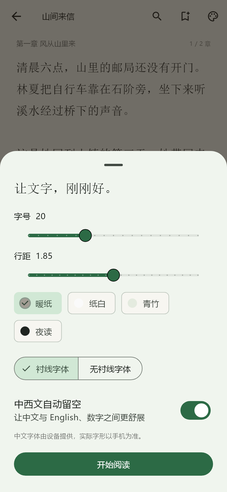

# 书叶 · Shuye Reader

给自己，一页安静。

<table><tr><td></td><td></td><td></td></tr></table>

以上是实际 Flutter 界面的渲染预览，使用本机字体，非安卓真机截图。

书叶是一款 **Android 本地阅读器**，用 Flutter / Dart 独立实现。参考提供的 Reeden 1.42.1 分析资料整理产品需求，使用自己的代码、图标与原创示例文章。不是 Reeden 官方产品，也没有恢复或包含其反编译代码、素材、授权接口或付费逻辑。

## 第一版已经实现

- TXT / EPUB 批量导入，SHA-256 内容去重；原文件移动后仍能阅读。
- TXT 支持 UTF-8、带 BOM 的 UTF-16、GBK；智能分章及自定义分章规则。超长章节自动分段，减少分页等待。
- EPUB 按 spine 顺序解析文字章节、书名、作者及可用封面，忽略脚本。
- 网格 / 列表书架，按书名 / 作者搜索，在读 / 读完筛选，继续上次阅读。
- 依据实际字体、视口、系统文字缩放进行分页；左右滑动和按钮翻页；章节目录与全文搜索。
- 四种纸色、夜读、字号 / 行距 / 系统字体、中西文自动间距。
- 可撤销的整行净化规则，保留原始正文；进度与笔记位置映射回原文。
- 文字摘录、位置笔记、回到笔记位置、Markdown 导出。
- 前台阅读时间、28 天阅读热力图；数据来自实际阅读，无预填统计。
- SQLite 本地书库、自动进度保存、完整 JSON 备份 / 事务恢复。
- 自有 Android 图标与 release 签名，GitHub Actions 自动检查及开发包构建。

## 安装

从本私有仓库的 **Releases → v0.1.0** 下载：

| APK | 适用设备 |
| --- | --- |
| `shuye-0.1.0-arm64-v8a.apk` | 大多数现代安卓手机，优先选择 |
| `shuye-0.1.0-armeabi-v7a.apk` | 旧款 32 位 ARM 设备 |
| `shuye-0.1.0-x86_64.apk` | x86_64 安卓设备 / 模拟器 |

系统若询问是否允许当前来源安装，请按需开启。Actions 产物是 **debug 开发包**，使用不同签名，不能直接覆盖正式签名的 release 安装；日常安装请选择 Releases。

应用最低 Android 7.0（API 24）。第一版尚需在你的手机上确认系统文件选择器、字体和手势的实际表现。

## 快速使用

1. 打开书叶，书架右上角 `+` 导入自己的 TXT / EPUB。
2. 点击封面阅读。底部目录跳章，左右滑动翻页；右上角搜索、摘录、排版设置。
3. 长按选中文字后点“摘录”；没有选区时可以给当前页记笔记。
4. 设置 → 导出完整备份。卸载、清除应用数据前务必备份。
5. 书架长按封面或在列表点菜单可移除书籍，操作会先确认。

## 当前边界

这是一款可运行的首版，**不是分析报告中全部功能的等价复刻**。

- 每本导入文件上限 20 MB；EPUB 解压内容上限 60 MB / 4000 条目。
- EPUB 目前是文字阅读，不显示正文插图、复杂 CSS、脚注跳转或音视频；加密 EPUB 不支持。
- 暂无 PDF、MOBI、漫画、OCR、TTS、AI、网盘同步、MCP、SQLCipher、仿真 GPU 卷页和原生小组件。
- 使用系统字体，中文衬线字形是否可用取决于设备；暂未实现专业标点压缩或英文连字符算法。
- 分章规则只影响之后导入的 TXT。净化规则针对整行；除内置规则外，不支持含括号的分组或前后向表达式。超过 4000 字符的单行跳过净化。
- 进度显示以当前页位置估计，看到最后一页时标记到章节末尾；阅读时间以秒采样，短于 5 秒的片段不计入。
- 本地数据库和导出备份没有应用级加密；备份含全文和笔记，请自行妥善保存。正式 APK 不请求网络和全盘文件权限，并关闭 Android 自动云备份。

## 开发与构建

使用 Flutter **3.47.2** / Dart **3.13.2**、JDK 21、Android SDK 36、NDK 28.2.13676358。依赖由 `pubspec.lock` 固定。

```sh
flutter pub get --enforce-lockfile
dart format --output=none --set-exit-if-changed lib test
flutter analyze
flutter test --concurrency=1
flutter run
flutter build apk --debug
```

正式版必须提供 `android/key.properties`，缺少签名时会明确拒绝 release 构建：

```properties
storeFile=C:/private/shuye-release.jks
storePassword=YOUR_PASSWORD
keyPassword=YOUR_PASSWORD
keyAlias=shuye
```

```sh
flutter build apk --release --split-per-abi
```

签名文件和密码已排除在 Git 之外。请保留首次签名材料，后续更新必须使用同一密钥。不要把密码、签名库、个人书籍或书库提交到仓库。

Windows 的 Flutter tester、Gradle / Kotlin 在部分中文路径下会出错。建议把项目、构建临时目录、Gradle 缓存放在英文路径，并在当前终端设置 `TEMP` / `TMP`，不用更改 Windows 全局设置。见 [Windows 构建说明](docs/windows-build.md)。

## 结构与依据

- `lib/models.dart`：书籍、章节、笔记、点分命名设置。
- `lib/importer.dart`：离线 TXT / EPUB 解析、净化、编码处理。
- `lib/repository.dart`：SQLite、去重、进度、统计、备份与事务恢复。
- `lib/reader.dart`：字体度量分页、原文位置映射、阅读交互。
- `lib/main.dart`：书架、笔记、统计与设置。
- `test/`：解析、编码、分页、持久化、恢复回滚及阅读交互测试。
- [设计说明与后续路线](docs/architecture.md)
- [验证记录](docs/verification.md)

参考库的官方使用说明：[Flutter Android 发布](https://docs.flutter.dev/deployment/android)、[sqflite](https://pub.dev/packages/sqflite)、[file_picker 10.3.10](https://pub.dev/packages/file_picker/versions/10.3.10)、[archive](https://pub.dev/packages/archive)、[xml](https://pub.dev/packages/xml)。

提供的静态分析报告作为需求输入，并未重新验证其 APK 真伪、隐私或性能结论；其原始对象池字符串、APK 和反汇编产物未纳入本仓库。
