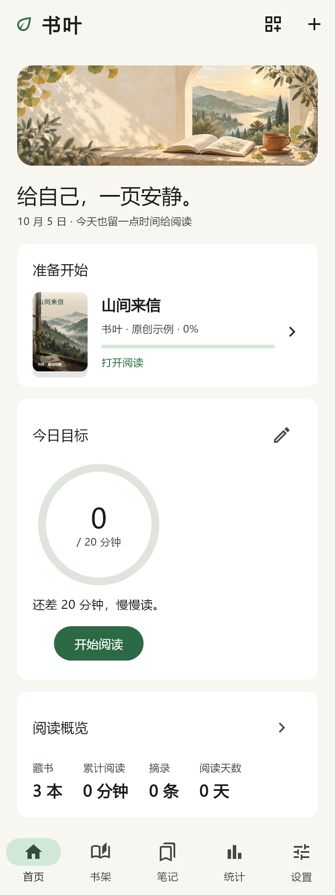
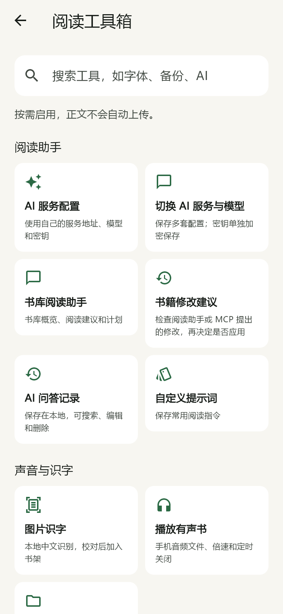

# 书叶 · Shuye Reader

给自己，一页安静。

<table><tr><td></td><td></td><td></td></tr></table>

实际 Flutter 界面预览，使用本机字体，非安卓真机截图。三个封面和书架横幅由 Codex 内置生图能力原创生成；书名与作者由 APP 叠加。

书叶是用 Flutter / Dart 独立实现的 Android 本地阅读器，参考用户提供的 Reeden 1.42.1 技术分析报告整理需求。使用自己的代码、图标、插画与示例文章，不包含原应用代码、素材、授权接口或付费逻辑。

## 0.3.0：根据实际录屏完善交互

- 首页集中显示续读、每日目标、真实统计和今日选读，卡片可拖动排序 / 隐藏，目标可选圆环或进度条，布局自动保存。
- 阅读工具箱改为按用途分组的入口，可搜索工具；所有入口仍连接实际功能。
- 标签、分类、书单、作者独立管理，可新建、搜索、加入书籍、整体重命名或移除分组。移除分组保留书籍与笔记；标签可多值，分类 / 书单 / 作者目前每书一值。
- 统计支持日 / 周 / 月 / 年 / 全部，以及历史时段切换和日历时长方格。数据由阅读记录汇总，不预填示例成绩。
- 应用支持跟随系统 / 浅色 / 深色及 85%–150% 文字缩放；阅读纸色仍由正文设置控制。
- 摘录卡片提供插画、夜色、日历、留白四种内置样式，记住上次选择；长文自然撑高，样式选择置于预览上方，导出不截断 emoji。
- 启动读取隐私设置前和书库锁定时隐藏内容；修复中途结束 Wi-Fi 下载导致的异步连接错误。

录屏观察与实际实现的对应关系见 [录屏借鉴记录](docs/video-reference.md)。它记录了可直接观察的交互，没有把菜单或服务名称当作实际服务联调的证据。

## 当前功能

- **导入与整理**：TXT、EPUB、PDF、Markdown、HTML、DOCX、RTF、CBZ，以及未加密的部分 PalmDOC / MOBI / AZW；ZIP 批量导入逐本报告失败，内容去重保留旧进度。五种书架布局、密度和排序设置；作者、分类、标签、评分、书评、书单与阅读目标；封面选择、人物关系图、生词分组、章节编辑、EPUB / TXT 导出。
- **正文阅读**：字体度量分页、长按选字、目录、全文搜索、原文位置笔记；纸张卷页、宽屏双页、墨水屏、简繁转换、英文断词与首字母加粗、标点字体特性、关键词高亮、净化与分章规则、主题和规则方案的保存 / 导入 / 导出、自定义字体、自动翻页、音量键 / 键盘翻页、亮度 / 方向 / 常亮、单手模式、遮罩、夜间时间表、休息提醒与细雨 / 轻雪氛围。
- **PDF 与漫画**：PDF 原版渲染、缩放、搜索、目录 / 缩略图、夜间反色、手写标注、文字提取重排、当前页中文 OCR；CBZ 自然页序、图片缩放与进度保存。
- **笔记与统计**：摘录、评论、标签、搜索、位置回跳、Markdown 导出与插画分享卡片；按日 / 小时统计、每日目标与 28 天热力图，无预填阅读数据。
- **AI 与声音**：用户自备 OpenAI 兼容地址 / 密钥 / 模型，保存多套配置与自定义提示词；当前段落 / 章节解释、书库概览、本地问答记录、可检查的书评与资料修改建议。中文图片识字使用本机 ML Kit；系统 TTS 可选语音与倍速。手机有声书支持音频库、续播位置、后台通知 / 耳机控制、倍速、定时与安卓均衡器。
- **数据与连接**：Android SQLCipher 加密书库、安全存储密钥、旧书库升级、指纹 / 屏幕锁验证；完整 JSON 与 AES-256-GCM 密码备份。WebDAV、S3、OneDrive、Dropbox、Google Drive 手动加密快照传输及记录；KOReader 进度读取 / PDF 进度上传；临时 Wi-Fi 加密备份下载。MCP 默认关闭、仅本机、令牌与会话验证，读取书库 / 笔记 / 统计 / 搜索，资料修改须在 APP 内检查后应用。
- **Android 桌面**：书架、当前书籍、统计、周报、热力图、摘录、书单七种桌面小组件，以及书籍 / 书架深链接。

各功能的完成程度、入口与限制见 [调研材料逐项对照](docs/report-coverage.md)。这轮是大幅补齐，仍不是原报告全部功能的等价实现。

## 安装与更新

从本私有仓库 [Releases → v0.3.0](https://github.com/z3275630-ops/shuye-reader/releases/tag/v0.3.0) 下载：

| APK | 适用设备 |
| --- | --- |
| `shuye-0.3.0-arm64-v8a.apk` | 大多数现代安卓手机，优先选择 |
| `shuye-0.3.0-armeabi-v7a.apk` | 旧款 32 位 ARM 设备 |
| `shuye-0.3.0-x86_64.apk` | x86_64 安卓设备 / 模拟器 |

最低 Android 7.0（API 24）。正式包沿用 0.1.0 的包名与签名，可以覆盖安装；请先从旧版设置导出备份，再安装更新。**不用卸载旧版**，卸载会删除本机数据库密钥和书库。旧数据库升级时会核验内容，并先保留加密恢复快照。

Actions 提供的 debug 开发包使用不同签名，不能覆盖正式版。正式 APK 的 SHA-256 可用同一 Release 中的 `SHA256SUMS.txt` 核对。

## 常用入口

1. 首页右上角布局按钮可调整卡片；底栏进入书架，书架右上角 `+` 导入文件；长按书籍 → 管理书籍，可改资料、封面、人物、生词和章节。
2. 正文右上角排版按钮 → 更多阅读控制；右上角菜单可自动翻页、听书、进度跳转、阅读助手、分享卡片和查看插图。
3. 设置 → 整理书库可管理标签 / 分类 / 书单 / 作者；设置 → 应用外观可切换深浅色；设置 → 阅读工具箱：AI、OCR、有声书、字体、方案、同步、备份、书库锁和 MCP。
4. 手机桌面长按空白位置 → 小组件 → 书叶。开启书库锁后，小组件内容隐藏。
5. 网盘与 AI 均使用自己的服务凭据，只在用户触发时发送数据。没有书叶账号、内置付费接口或自动上传。

## 数据与兼容限制

- 每本文件上限 20 MB，压缩内容上限 60 MB / 4000 条目，备份导入上限 80 MB。音频文件上限 512 MB，复制在本机；音频副本与自定义字体不会随简单主题方案分发，换手机的音频文件需重新导入。
- EPUB 保留提取文字和章节图片，图片从阅读菜单查看；尚不还原原书的 CSS、图片行内位置、脚注跳转、音视频或完整编辑结构。导出 EPUB 是依据书叶内容重新生成的文件。
- DOCX / RTF / Markdown / HTML 以文字导入为主。Kindle 仅支持未加密的未压缩 / PalmDOC 文本记录，不能承诺完整 KF8 / AZW3；DRM、HUFF/CDIC、旧 DOC 和 RAR/CBR 需先转换。
- PDF 标注保存在书叶书库中，不写回原 PDF；OCR 当前为单张图片 / 当前 PDF 页的中文与拉丁文字识别。文字提取可处理整个 PDF 的现有文字层。
- 同步是用户触发的加密快照上传 / 替换恢复，未实现自动增量、冲突合并、OAuth 刷新。云盘令牌须具备对应权限并自行更新。百度网盘和 123 云盘原生 API 暂未接入；支持 WebDAV 的云盘可用 WebDAV 配置。
- KOReader 文本书按百分比近似读取进度，上传仅支持 PDF；按文件名匹配时，两端文件名需一致，KOReader 需选择对应匹配方式。
- 系统 TTS 取决于手机语音引擎；若所选语音需要联网，系统引擎可能发送朗读文本。未接入 Azure / 阿里 / 字节 / Edge 云 TTS、Tavily、Paddle / MinerU / ONNX OCR。
- 密码备份不导出 API 密钥、网盘密码或数据库密钥。**普通 JSON 备份含全文和笔记，未加密**；对外转移请选择加密备份。忘记备份密码不能解密。
- 阅读统计只采样前台阅读；弹窗、后台与遮罩不计时，短于 5 秒的片段不计入。PDF 的短暂菜单浏览和漫画统计覆盖仍有限。

## 开发与构建

Flutter **3.47.2** / Dart **3.13.2**、JDK 21、Android SDK 36、NDK 28.2.13676358。依赖由 `pubspec.lock` 固定。

```sh
flutter pub get --enforce-lockfile
dart format --output=none --set-exit-if-changed lib test
flutter analyze
flutter test --concurrency=1
flutter build apk --debug
```

正式版需自行提供 `android/key.properties`：

```properties
storeFile=C:/private/shuye-release.jks
storePassword=YOUR_PASSWORD
keyPassword=YOUR_PASSWORD
keyAlias=shuye
```

```sh
flutter build apk --release --split-per-abi
```

签名、密码、个人书库均不进入 Git。Windows 中文路径问题可用独立英文构建目录和 `TEMP` / `TMP` 避免，不修改全局设置；见 [Windows 构建说明](docs/windows-build.md)。

## 实现与验证

- [录屏借鉴记录](docs/video-reference.md)
- [架构与数据模型](docs/architecture.md)
- [调研材料逐项对照](docs/report-coverage.md)
- [验证记录与未验证范围](docs/verification.md)
- [原创图片和完整生图提示词](docs/image-assets.md)
- [服务配置说明](docs/services.md)

原报告作为需求资料，原始 APK 真伪、隐私与性能推断未重新验证；对象池、反汇编产物和第三方阅读内容未纳入仓库。
