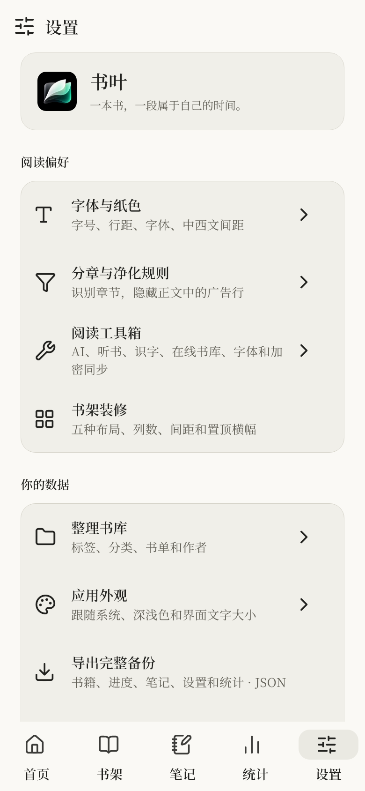
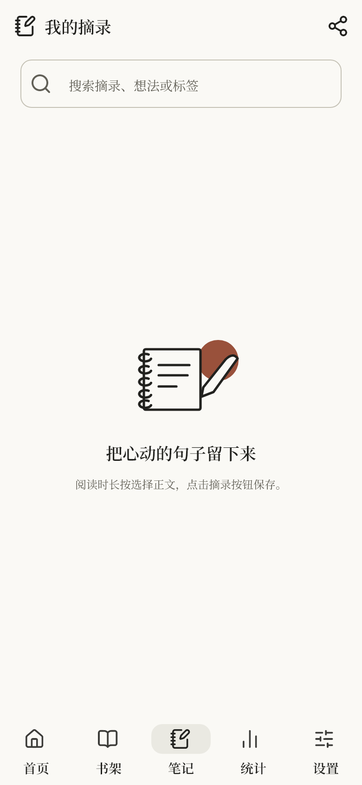
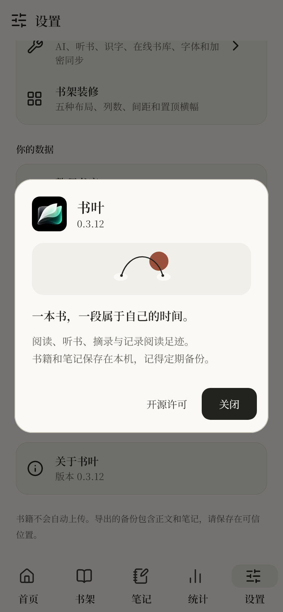

# 0.3.12 验证 · 2026-10-06

版本 `0.3.12+15`，Android `dev.shuye.shuye_reader`，ARM64 版本码 2015。基于 0.3.11 主线 a0b8b60106087809cb91e6e0b08fc3f997167756；未覆盖其他 Agent 的修改，没有待审 PR。

## 变化与参考

用户要求换功能图标、减少相同插画、加深加粗标题，并选择性吸收有依据的 Issue。#60 / #61 / #62 / #64 / #67 / #69 已实施；#65 继续部分采纳；#66 无衬线方案与用户的全默认衬线要求冲突，不采纳；#68 本机 HTTP 缺少 Android 复现证据，暂缓。旧 18 项待做继续保留，完整衔接见 [取舍表](prd/review-2026-10-05.md)。

参考 [tungloong/cherry-studio-claude-style-theme](https://github.com/tungloong/cherry-studio-claude-style-theme) 的文字层级、暖色表面和强调色关系。该项目针对桌面 CSS，不能作为 Android 官方字号标准；Styrene / Tiempos 是其声明的字体，本版没有提取或分发专有字体。保留授权的 Noto Serif SC 裁剪字体。

功能图标保留 ShuyeIcon 接口，使用固定 `lucide_icons_flutter 3.1.22` 来源的本地修改子集 `3.1.22+shuye.1`，仅含 59 个默认字形；不是未修改的上游发行版。共享 Flutter / pub 缓存未修改，无 SVG 运行解码器。MIT / ISC / Feather MIT 声明分别保留，源码、字形和上游发行包校验见 `third_party/lucide_icons_flutter/audit.json`。

真实 600 字重 UI 子集含 1,284 个码点、373,816 字节，SHA-256 `c00232f38acdd74a68d37e2927ad07cfc748882b12feb30b2b32f615aed1542d`。普通正文仍为 400；600 子集不保证任意书名生僻字覆盖。标题 20 / 顶栏 18 / 列表 15 / 导航 14dp，600 字重；默认正文仍 18dp / 1.65 / 0 字距。没有用增大全局字号代替加粗。

首页叶子保留，书架书脊、摘录笔记本和笔、关于页桥均为原生静态路径；设置身份卡取消重复插画。新插画没有截取参考图或水印。白绿桌面图标和已有纸色保留。

## 自动验证

- Flutter 3.47.2 / Dart 3.13.2，英文临时副本及独立 TEMP / 构建目录。
- `flutter pub get --enforce-lockfile` 通过；`dart format --output=none --set-exit-if-changed lib test third_party/lucide_icons_flutter/lib`：64 文件、0 修改；`flutter analyze --no-pub`：无问题。
- `flutter test --no-pub --concurrency=1 --timeout 60s`：117 项通过，10 项可选预览跳过。
- 六份可选预览测试开启实际字体：20 项通过，66 张 PNG。普通 390dp 与 320dp / 150% 字号压力图分开；浅深及四种配色覆盖。人工查看设置、阅读、首页、摘录、关于和空热力图等实际渲染。
- 新回归覆盖不可变进度快照合并、同步 / 异步保存失败重试、真实 SQLite 备份等待与恢复代次、字体加载缓存 / 失败重试、分享清理边界、音频登记失败回滚、正文对齐与分页完整性、锁定计时 / 翻页、热力图切换高度和起点、小屏摘录键盘滚动。
- 构建 / 验证副本与提交的运行源码、测试、字体、许可和本地依赖逐文件一致。

截图使用 Flutter 测试渲染和实际打包字体，不是手机截图；彩色热力图数据仅用于截图测试，生产应用不补造记录。没有宣称 Android 生物认证、原生 PDF、系统栏、背景音频或 localhost 已实测，也没有真机功耗、温度、帧耗时数据。

## 安装包

`flutter build apk --release --target-platform android-arm64 --split-per-abi --no-pub` 通过。正式签名包 `Shuye-0.3.12-arm64-v8a.apk`：

| 项目 | 核验 |
| --- | --- |
| 大小 | 30,432,881 字节，30.43 MB / 约 29.02 MiB |
| 较 0.3.11 | 增加 264,817 字节，约 0.88% |
| SHA-256 | `49b6e30cc2bff2809dc23be8c6393fd26915afe2af10ab8ce37a872a1e0ea9e1` |
| 签名 | apksigner 验证成功，v2；与上一版证书相同 |
| 证书 SHA-256 | `03f258a82e60226f8c9b305a1d1a97f1bd1871ff10f6754fe280a25432dbb8ce` |
| 版本 | 0.3.12 / 2015，min SDK 24，target SDK 36 |
| 架构与压缩 | 只有 arm64-v8a；六份原生库仍 DEFLATE 压缩，JNI useLegacyPackaging 保留 |
| 对齐 | zipalign 4 字节 / 16 KB 检查通过；六份 ELF 的 LOAD 对齐均至少 16 KB |

字体清单只有一个 Lucide 默认家族，发布后为 21,644 字节；没有六份未使用字重。600 字重压缩约 235 KB，Lucide 默认字形压缩约 13 KB；总增量以上表实际安装包比较为准，不能简单把源码资源大小相加。Flutter、OCR、PDFium、SQLCipher 四份原生库与前版字节相同；libapp 与 libdartjni 校验不同，六份解压大小均与前版相同。构建器对既有音频插件给出 Built-in Kotlin 迁移提示，未阻断构建；后续按上游兼容版本处理。

同包名、同签名、更高版本码，支持覆盖升级的签名条件已核对。建议升级前导出完整备份；安装时不要卸载旧版。覆盖安装和实际书库迁移仍待手机验证。CI 的实际状态以此提交关联的 GitHub Actions 为准。

## 界面证据

<table><tr><td></td><td></td><td></td></tr></table>

阅读对齐、标题颜色等参数集中于 appearance / reader；裁剪过程见字体目录及 third_party README，不修改用户导入字体。
