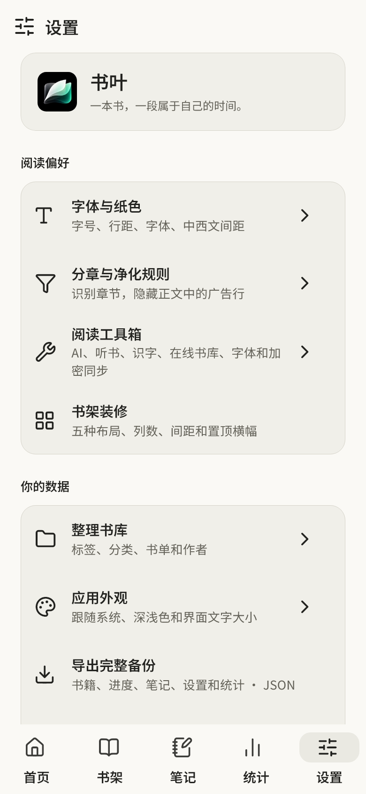
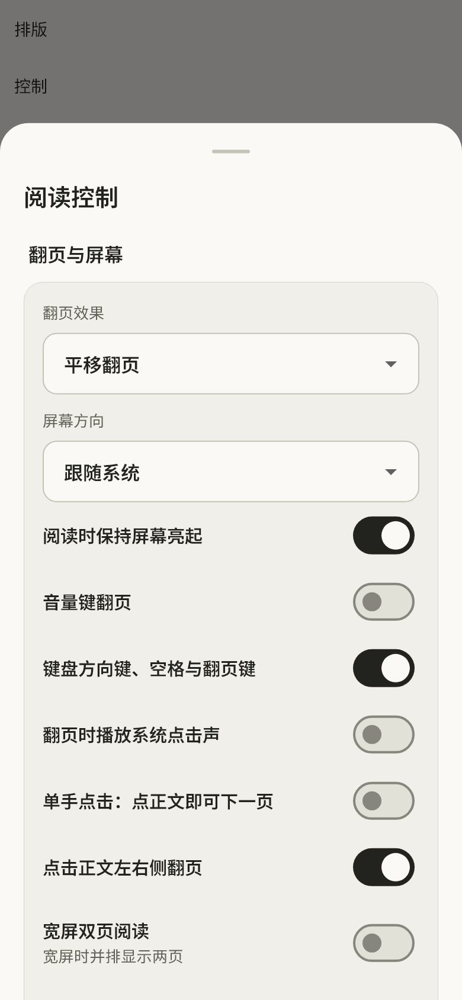

# 0.3.13 验证 · 2026-10-06

版本 `0.3.13+16`，包名 `dev.shuye.shuye_reader`，ARM64 版本码 2016。基于 0.3.12 main `59f69dbe6c479823d1c342cadf3ea4df34236fed`；本轮先修 #70，再调整字体。远端 main 核对与基线一致，没有覆盖其他 Agent 的工作。

## 变化与来源

- #70：正文约束固定，工具栏叠层显隐，不再因点中央重建分页；平移模式当前页与相邻页跟手移动。短拖回弹、系统取消、打开面板、后台与隐私锁不会提交待完成翻页。正常翻页动画结束后才更新章、页、offset 和保存；连续按钮操作排队。
- 相邻页使用相同字体、宽高、缩放和净化规则预备；最多三份布局缓存。平移不再截图，移除平移及双页宽阴影；仿真 / 淡入保留既有快照，创建失败回退为平移。墨水屏和减少动画直接换页。真实窗口大小 / 方向变动可以重新布局，临时系统栏变化和工具栏显隐不改变正文约束。
- #66：按用户“实际效果优先”的新要求重新采纳界面 / 内容分工。界面 Shuye Sans（Noto Sans SC 裁剪）400 / 600，欢迎语保持宋体；正文独立选择黑体 / 宋体，已有正文选择和自定义字体不自动改写。
- [ChatNest 固定提交](https://github.com/ugui3u/chatnest/tree/4fa55de73bcde5a1a45a7d30d7dff345b1de896c) 的公开字体栈、字号与行距作为社区参考；不是 Claude 官方 Android 精确参数，没有复制其网页代码。Poppins / Styrene B 不作为必须使用的字体。选择有常用中文覆盖的 Noto Sans，而不是仅更换拉丁字体后依赖未知中文回退。
- Sans 字体来源、哈希、真实 400 / 600 字重与覆盖记录于字体目录；新增压缩资源估算约 2.22 MB，无新增运行依赖。400 含 10,353 码点，600 的 UI 子集含 1,284 码点；生僻字仍可能系统回退，不声称完整 Unicode 或任意正文粗体覆盖。

## 自动检查与预览

- `dart format --output=none --set-exit-if-changed lib test`：65 文件、0 修改。
- `flutter analyze --no-pub`：无问题。
- 最终 `flutter test --no-pub --concurrency=1 --timeout 60s`：124 项通过，10 项可选预览跳过。
- 新七项回归覆盖控件 / 临时系统栏变化与真正窗口缩放、双方向跟手移动、短拖与取消、排队、首末边界、跨章节及双页。集成测试真实发送指针移动和 PointerCancel，确认当前页与 offset 不变；不是只直接调用拖动回调。
- 额外开启实际打包字体预览，保留 48 张 PNG。人工查看设置标题、首页、浅深阅读控制、320dp / 150% 大字、黑体正文、中央点击收起后的全屏及正文切换。新增字体选择和全屏在可选端到端预览测试中使用实际控件点击通过。
- 图像为 Flutter 电脑测试渲染与实际打包字体，不是 Android 手机截图。彩色统计数据仅存在于预览测试，不向正式书库补造记录。

尚未手机实测 Android 系统栏、真实翻页帧耗时、温度、功耗或字体回退差异。TXT / EPUB 共用转换后的正文分页路径，原版 PDF / 漫画不使用本次正文翻页器；未把七项回归描述为所有文件格式均在手机验证。

## 安装包

`flutter build apk --release --target-platform android-arm64 --split-per-abi --no-pub` 通过；正式签名 ARM64 包已核验。

| 项目 | 结果 |
| --- | --- |
| 大小 | 32,670,419 字节，32.67 MB / 约 31.16 MiB |
| 较 0.3.12 | 增加 2,237,538 字节，约 7.35% |
| SHA-256 | `9f733309805acd07dfa3cb976a00114e461e10def8362d35f1d57033a9df8bc5` |
| 包名 / 版本 | `dev.shuye.shuye_reader` / 0.3.13 / 2016；min SDK 24、target SDK 36 |
| 签名 | apksigner 验证成功，与前版相同；证书 SHA-256 `03f258a82e60226f8c9b305a1d1a97f1bd1871ff10f6754fe280a25432dbb8ce` |
| 架构 / 压缩 | 仅 ARM64，六份原生库继续 DEFLATE 压缩，useLegacyPackaging 保留 |
| 对齐 | zipalign 4 字节 / 16 KB 检查通过；六份 ELF LOAD 对齐至少 16 KB |
| 字体 | APK 内 Sans / Serif 各 400、600 两份，与源码 TTF 逐字节相同，Sans OFL 已打包 |

Flutter / OCR / PDFium / SQLCipher 原生库与 0.3.12 字节相同。新字体压缩约 2.22 MB，实际整包增量约 2.24 MB；没有新增网络下载字体或运行依赖。Windows 构建使用独立英文副本和既有 Gradle 缓存；先前空缓存下载尝试已中止，只停止此次 wrapper，没有终止其他 Agent / 共享 daemon。

验证副本、构建副本与正式源码的 lib / test / pubspec / lock / 字体 / 本地图标包 / shader 校验一致。Gradle 保留既有 file_picker / share_plus 的 Built-in Kotlin 迁移提示，本轮构建成功；不因该提示升级共享 SDK。覆盖升级的签名条件已核对，未做手机覆盖安装或书库迁移验证。

## 界面证据

<table><tr><td></td><td></td><td></td></tr></table>
