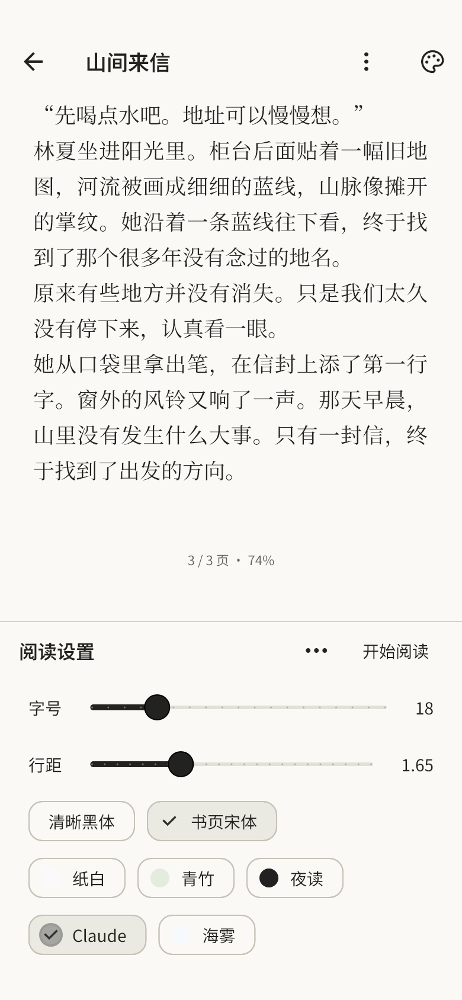

# 0.3.14 验证 · 2026-10-06

版本 `0.3.14+17`，包名 `dev.shuye.shuye_reader`，ARM64 版本码 2017。基于 0.3.13 main `c5ca2100dc0c553730824519eba305f61f2fc47e`。用户反馈并提供两段录屏：书叶平移交接跳动，微信读书打开即全屏，工具栏在留白中显隐，调整排版仍能看到正文。#70 重新开放，本轮实现后仍等待用户手机验收。

## 修复

- 当前正文使用 SelectableText，而旧相邻预览使用 RichText 并继承不同的默认文本样式；相同约束不能保证同样的字形与换行。当前页、相邻页和双页改为相同 SelectableText 渲染，明确 inherit、baseline、字距与 cursorWidth，消除动画交接时的排版差异。
- 简单横向平移沿用单调 easeOutCubic，不增加震颤、弹簧、阴影或截图。新一轮结算先清零旧动画，避免连续拖动短暂使用上一轮终点；零位移、零速度的空白点击不启动回弹。
- 真实满页正文会竞争 Flutter 手势：明确横移超过 touch slop 时由阅读横滑先获胜；停留长按交给原生选字。250ms 区分停留，280ms 点按等待沿用双击识别；只在当前指针、非选择、非隐私锁状态处理翻页。
- 正文首次进入隐藏顶栏和底栏；中央点按唤回。顶栏只占章节标题的 56dp 留白，底栏占页码留白（正常 64dp，大字自适应）；显隐和临时系统栏不移动字形、不改变页身份。Android 原生全屏接口沿用。
- 阅读排版的常用字号、行距、字体、纸色移入底部独立区域。只在展开设置或真实窗口变化时重新分页；正文在上方实时预览，不用假样例替代。展开前保留源文字 offset，调整和收起沿用该锚点；系统返回键先收起设置。
- 完整编辑器由“…”和全局设置访问；个人字体、净化、章节、缩放、配色联动、进度及书库数据约定保留。

## 验证

- `dart format lib test`：66 文件、0 修改；`flutter analyze --no-pub` 无问题。
- 最终完整 `flutter test --no-pub --concurrency=1`：125 项通过，10 项可选预览跳过。
- Android 平台变体加载实际打包字体，在中文 / 英文混排的满页正文发送真实横滑。验证预览与落定后文本、逐行 glyph boxes、高度与屏幕位置完全一致；真实满页横滑能切页，长按得到非折叠选择并阻止翻页。
- 视口回归覆盖默认隐藏、空白点按、控制栏不覆盖正文、取消 / 边界 / 队列 / 跨章、单页 / 双页、设置收起返回原 offset 和页内容、2.25 倍字体及系统返回键。现有导航、配色、隐私、数据库测试通过。
- 可选实际字体预览覆盖默认全屏、拖动中途、动画结算、完成页、工具栏、设置展开及浅深主题。拖动截图前断言真实 displacement = -140dp，避免将未翻动的静态截图作为运动证据。预览为电脑 Flutter 渲染，不是 Android 手机截图。
- 尚无 ADB 设备连接：没有进行手机覆盖安装、系统栏、真实滑动帧耗时、温度、功耗或厂商字体回退测试。原版 PDF / 漫画不使用此次正文分页器，不能把正文回归描述为所有格式均已验收。

## 安装包

独立英文副本构建 release ARM64，正式签名核验通过。

| 项目 | 结果 |
| --- | --- |
| 大小 | 32,673,371 字节，32.67 MB；比 0.3.13 增加 2,952 字节 |
| SHA-256 | `b6c3a0b28b63f909766f67631dea688e254c3318c60eba820da61747f2cac191` |
| 包名 / 版本 | `dev.shuye.shuye_reader` / 0.3.14 / 2017；min SDK 24，target SDK 36 |
| 签名 | apksigner 通过，与旧版相同；证书 SHA-256 `03f258a82e60226f8c9b305a1d1a97f1bd1871ff10f6754fe280a25432dbb8ce` |
| 架构 / 压缩 | 仅 ARM64，六份原生库 DEFLATE；useLegacyPackaging 保留 |
| 对齐 | zipalign 4 字节 / 16 KB 通过，六份 ELF LOAD 对齐至少 16 KB |
| 资源 / 依赖 | 字体 6 份及插画 5 份与旧版逐字节相同；没有新增运行依赖 |

正式源码、验证和构建的 lib / assets / 本地图标包一致，pubspec 与依赖锁同步。签名配置只在本机英文构建副本保管，没有提交密钥。既有 file_picker / share_plus Kotlin 迁移提示不影响本次成功构建；未修改共享 SDK、缓存或其他 Agent 的运行目录。

## 界面证据

<table><tr><td></td><td></td><td></td></tr></table>

拖动与夜间设置截图同目录保存。读者的个性化排版不会被本版更改为录屏中的字号。
