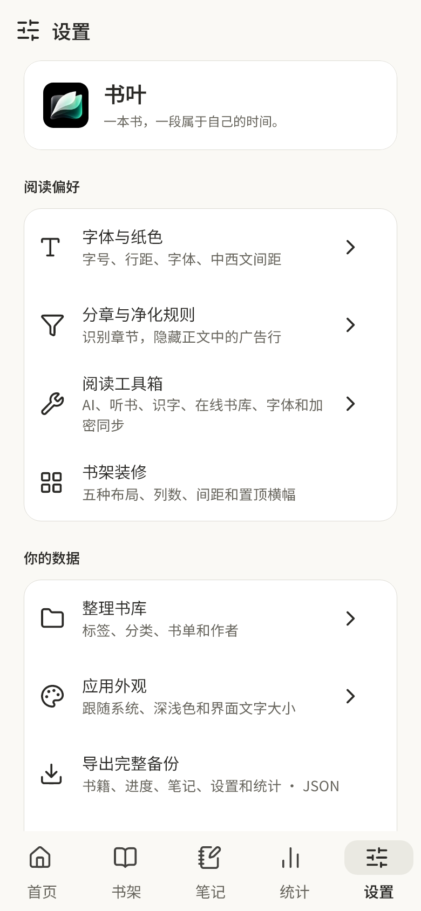
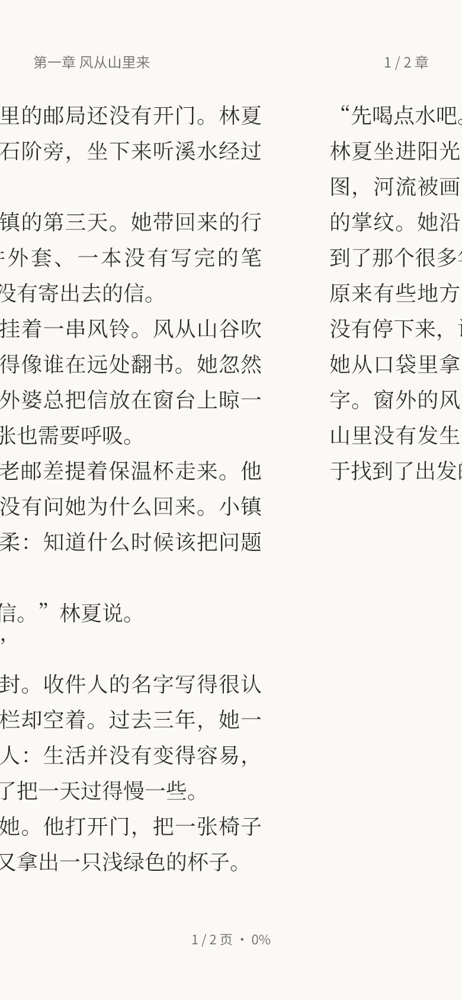
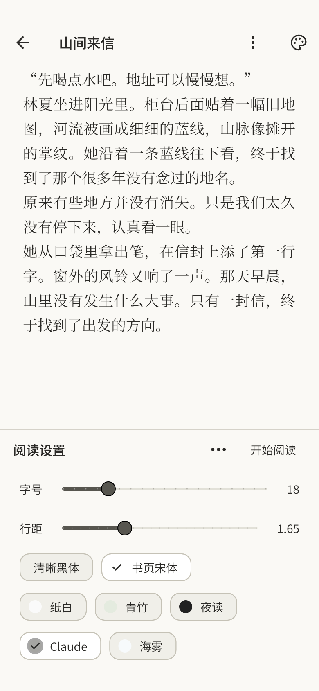

# 0.3.15 验证 · 2026-10-07

版本 `0.3.15+18`，包名 `dev.shuye.shuye_reader`，ARM64 版本码 2018。基于 0.3.14 main `0300a6d97a5338b4f55f63bd501b35a8fc9e2f19`。用户提供书叶、Claude 手机版网页设置、微信读书对比三段录屏；复查 #71–#74，远端无待审 PR。

## 改动

- 旧平移只移动文字区域，左右页边距固定在外层，导致两页文字在接缝处连起来。每页改为独立纸面、裁切与完整左右留白，整页随手指移动；当前 / 相邻 / 双页继续使用同样 SelectableText 字形策略。
- 普通阅读取消 280ms 双击等待，短点按立即响应；长按仍让位于原生选字，隐私遮罩自己的双击解锁保留。顶底栏在留白中 150ms 淡入 / 小幅位移，关闭动画时直接显隐。
- 松手联合距离与速度判断；快短滑可提交，反向收手取消，剩余路程越短收尾越快。结算无震颤、弹簧、宽阴影或截图，动画完成后提交和首帧交接约定保留；首末页不增加阻尼。
- 打开设置保持整个页画布与文字位置，仅裁切底部可见区域，设置使用独立底部区域。收起回到全屏；普通纸色 / 亮度 / 工具设置不重新分页，改变字号 / 行距 / 字体 / 几何设置才沿源 offset 分页。英文首字加粗和关键词对加粗的影响纳入几何键。
- 首帧之后预热相邻章节，缓存上限三份；预热不在 build 或手指移动回调中同步运行。过期布局 / 恢复书库 / 退出时丢弃待执行任务；本轮不引入 descriptor 大重构。
- Claude 浅色主字 #2B2A27、辅助字 #66645C，普通设置项 15dp / 400，真正标题与选中导航保留 600，未选导航 400。内容卡白、输入与控件暖灰，滑杆中性灰小圆点；保留主要操作的黑白对比。不替换字体或用户正文排版。
- 热力图局部采用精简周标签、等宽汇总数字、月格 3dp 圆角；固定色阶、完整未阅读方格、手机点选及真实数据保留。#72 纸面 Morph 不采用。详细取舍见 [衔接表](prd/review-2026-10-05.md)。

## 验证

- `dart format lib test`：66 文件、最终 0 修改；`flutter analyze --no-pub` 无问题。
- 完整 `flutter test --no-pub --concurrency=1`：127 项通过，10 项可选预览跳过。
- 新增中文实际字体接缝回归：中途拖动两页文字之间为双侧完整边距，预览与落定后的逐行 glyph boxes、尺寸、位置一致；既有真实横滑、长按选字、取消、跨章、双页和连续翻页约束保留。
- 验证即时点按、反向松手、快速短滑、按剩余距离结算；开关工具栏 / 设置不移动当前正文或 offset，换夜读配色不改变页身份。320dp / 大字、主题保存 / 全应用联动、系统返回收起设置及数据 / 隐私回归通过。
- 主字和辅助字在 Claude 浅深六级表面均至少 4.5:1；强调文字在实际页面、普通面板、白卡检查至少 4.5:1。
- 4 项可选预览检查通过，生成 43 张实际字体预览，覆盖设置、阅读默认全屏、拖动 / 结算 / 落定、控件、独立设置、浅深配色。截图为 Windows Flutter 渲染，不能替代 Android 手机。
- `adb devices` 无设备：没有手机覆盖安装、系统栏、真实滑动帧耗时、功耗 / 温度验收。#70 / #74 保持开放；原版 PDF / 漫画不使用此次正文分页器，不宣称全部格式已经验收。

## 安装包

独立英文副本构建正式签名 release ARM64，沿用既有签名 / 依赖缓存，不修改共享 SDK 或其他 Agent 的进程。

| 项目 | 结果 |
| --- | --- |
| 大小 | 32678923 字节，32.68 MB；比 0.3.14 增加 5,552 字节 |
| SHA-256 | `9df1221840067d74df1d9a83ff4f5dc6b9906eefb1546d07ffdd3d921cc5e529` |
| 包名 / 版本 | `dev.shuye.shuye_reader` / 0.3.15 / 2018；min SDK 24，target SDK 36 |
| 签名 | apksigner 通过，与旧版相同；证书 SHA-256 `03f258a82e60226f8c9b305a1d1a97f1bd1871ff10f6754fe280a25432dbb8ce` |
| 架构 / 压缩 | 仅 ARM64，六份原生库 DEFLATE；useLegacyPackaging 保留 |
| 对齐 | zipalign 4 字节 / 16 KB 通过，六份 ELF LOAD 对齐至少 16 KB |
| 资源 / 依赖 | 字体 6 份与插画 5 份逐字节相同，无新增依赖或资源 |

正式源码、验证和构建副本的 lib / assets / 本地图标包一致，pubspec 与锁文件同步。签名配置只在本机构建副本保管，没有提交密钥。

## 界面证据

<table><tr><td></td><td></td><td></td></tr></table>
