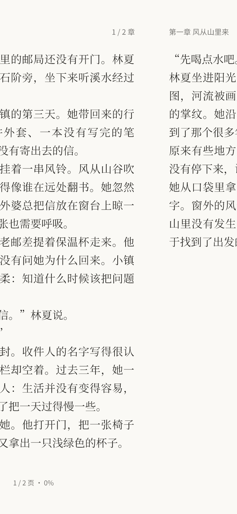

# 0.3.16 验证 · 2026-10-07

版本 `0.3.16+19`，包名 `dev.shuye.shuye_reader`，ARM64 版本码 2019。基于 0.3.15 main `db9a6c55107b43a2c8d149518f45ae492b72e753`。用户录屏反馈翻页仍有停顿、顶部信息没有随正文移动，同时确认这版字体与配色不错。

## 改动与依据

- 旧版章名、章节编号和页码在平移容器之外，只有正文滑动。现在每张纸面包含自己的顶部章名 / 章节编号、正文及底部页码 / 全书进度，统一平移；跨章预览展示目标章的信息。页边留白、正文高度和分页位置保持原有约束，工具按钮仍占用留白。
- 旧版下一页的 SelectableText 在第一次移动时才挂载，而且没有独立 RepaintBoundary。现在只保持当前页和前后两张纸面，相邻纸面提前离屏布局，隐藏时不绘制、不暴露语义；当前与进入页均隔离重绘，拖动和结算只改变平移位置，没有新截图或着色器路径。
- 原先手指松开后统一重新跑 easeOutCubic，初始结算速度与手指速度无关。拖动结算改用端点速度约束曲线，按实际松手速度衔接并在目标停下；单调范围限制避免过冲和震颤。按钮翻页保留原有曲线。
- 连续新拖动可以接管尚未提交的平移结算，保留当前位移；旧结算取消，不再提交旧进度。到达目标后没有空等固定动画时长。其他效果、隐私锁定、后台取消和按钮排队保留。
- 邻章分页预热在拖动 / 结算期间延期，避免把同步分页安排到翻页帧末。仍是主线程预热，极长章节的总体加载耗时没有被此次局部修改消除。
- 用户认可的 0.3.15 字体与配色保持不变；没有修改 appearance.dart、字体资源、默认正文排版、导入字体、书库或统计数据。

采用 Flutter 官方的 [性能建议](https://docs.flutter.dev/perf/best-practices) 与 [RepaintBoundary](https://api.flutter.dev/flutter/widgets/RepaintBoundary-class.html) 分离静态内容和移动变换。录屏能够证明视觉症状，不能单凭视频精确区分 UI 线程、GPU、系统录屏编码的帧耗时。

## 验证范围

- 真实打包中文字体测试验证当前与相邻正文接缝保持双侧边距，预览与提交后的逐行字形位置、尺寸及正文内容相同。
- 跨章测试验证两页章名和章节编号分别按整页位移移动；页脚位置也按相同位移移动，目标页脚进度与提交后的书籍进度一致。
- 使用实际 SelectableText 的渲染计数回归：相邻页在手势开始前已布局；首次显露后，十次连续拖动和五个结算帧都没有新增正文布局或绘制。
- 验证松手后第一毫秒位移与实际释放速度衔接、新拖动接管动画无位置跳变、不提交被取消翻页。保留反向收手、短拖、排队、长按选字、跨章、双页、设置裁切、夜读、大字和数据回归。
- `adb devices` 没有连接设备：没有 Android 实际帧耗时、覆盖安装或系统栏验收。#70 / #74 保持开放，等待手机复查；原版 PDF / 漫画不使用此正文分页器，不宣称全格式已验收。

## 最终结果

- `dart format lib test` 最终 66 文件、0 修改；`flutter analyze --no-pub` 无问题。
- 完整 `flutter test --no-pub --concurrency=1`：129 项通过、10 项可选预览跳过。增强真实 SelectableText 渲染计数及页脚断言后，12 项阅读回归再检查通过。
- 4 项预览检查通过，生成 43 张实际字体预览。与 0.3.15 的浅 / 深阅读默认页、深色设置、黑体全屏正文和阅读设置预览逐像素一致；拖动图验证信息随页移动。均为 Windows Flutter 渲染，不是 Android 手机截图。
- 独立英文副本 release ARM64 构建通过。源码、验证副本、构建副本 lib / assets / 本地图标包逐文件一致，pubspec 与锁文件一致；签名配置只在构建副本保留。

## 安装包

| 项目 | 结果 |
| --- | --- |
| 大小 | 32,677,891 字节，32.68 MB；比 0.3.15 减少 1,032 字节 |
| SHA-256 | `d45e331d5cf83f678d8fac0f0c1b1d6ff0f15aa6903e2a103b2e6e9b4568428c` |
| 包名 / 版本 | `dev.shuye.shuye_reader` / 0.3.16 / 2019；min SDK 24，target SDK 36 |
| 签名 | apksigner 通过，与 0.3.15 相同；证书 SHA-256 `03f258a82e60226f8c9b305a1d1a97f1bd1871ff10f6754fe280a25432dbb8ce` |
| 架构 / 压缩 | 仅 ARM64，六份原生库 DEFLATE；useLegacyPackaging 保留 |
| 对齐 | zipalign 4 字节 / 16 KB 通过，六份 ELF LOAD 对齐至少 16 KB |
| 资源 / 依赖 | 字体 6 份与插画 5 份逐字节相同，无新增依赖或资源 |

没有连接手机进行安装或性能测试。更新后重点复查同章前后翻、跨章往返、连续快速拖动和松手后再次拖动；不能用上述包体 / 渲染计数结果推断真实功耗、温度或 Android 帧率。

## 界面证据

<table><tr><td></td><td></td><td></td></tr></table>
